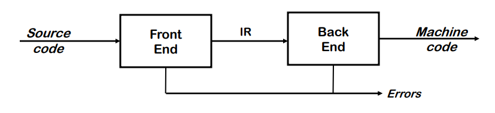

# Introdução

## Compilador vs. Interpretador

O compilador transforma um executável escrito numa linguagem em outro executável noutra linguagem. Nessa transformação consegue às vezes melhorar o programa. C é um exemplo de linguagem compilada.  
Já o interpretador apenas lê um executável e produz os resultados da sua execução. Python é um exemplo de linguagem interpretada.

A linguagem Java usa as duas versões, numa `Just-in-time compilation`: compila as partes do código mais utilizadas ao longo da execução, para aumento de performance.

## Funcionamento de um Compilador

O `Front End` é responsável por transformar o código de raiz numa representação intermédia (IR), sinalizando os erros de sintaxe e semântica que possam estar contidos. As representações internas são uma espécie de árvore sintática abstrata (*abstract syntax tree*) formada e validada através de uma gramática livre de contexto. É um processo na ordem de O(n) ou, no máximo, O(nlogn).

A representação interna serve para termos uma zona comum em todas as linguagens, permitindo generalizar o problema por motivos de eficiência e compatibilidade com outros compiladores e sistemas.

O `Back End` é responsável por transformar a representação intermédia em código máquina, sinalizando erros que possam estar contidos. É um processo NP-Completo que funciona em três etapas:

- **Instruction Selection**: seleciona as instruções necessárias para executar o conjunto de padrões (usando *pattern matching*) avistados na representação intermédia;
- **Register Allocation**: coloca cada valor num registo quando este vai ser utilizado. Manipula um conjunto escasso de recursos e as instruções são Loads e Stores. A alocação ótima de registos é um problema NP-Completo;
- **Instruction Scheduling**: pode aumentar o tempo de vida das variáveis usadas, para aumentar a funcionalidade e produtividade;

Entre o Front End e o Back End podemos ter um `Middle End` que iterativamente melhora a qualidade do código sob o ponto de vista de eficiência temporal e utilização de recursos.